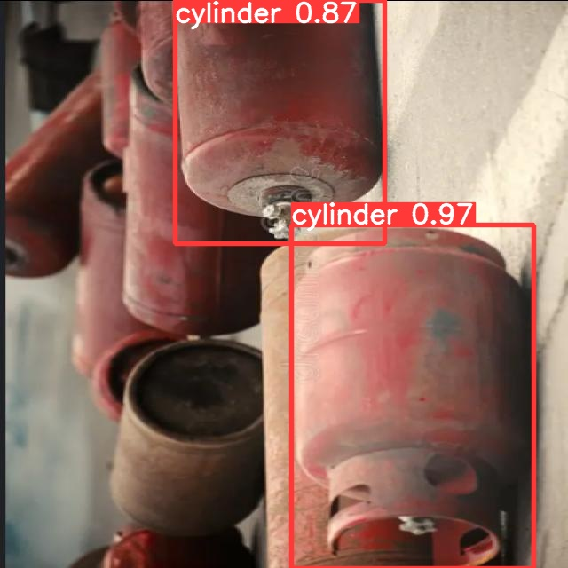
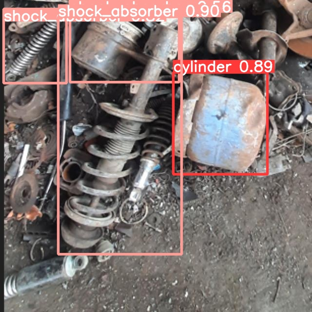

# HazWaste Detection System using YOLOv9 and FastAPI

## Overview

An end-to-end Deep Learning and Computer Vision project developed to detect hazardous industrial waste objects such as **cylinders** and **shock absorbers** from images using YOLOv9. The project covers the complete AI workflow, including dataset collection, annotation using Roboflow, model training, evaluation, and deployment through FastAPI for real-time predictions.

The dataset was created from real industrial waste images provided by a client, making the project closely aligned with real-world waste management and environmental monitoring applications.

## Key Features

* Custom dataset annotation using Roboflow
* Detection of hazardous industrial waste objects such as cylinders and shock absorbers using YOLOv9
* Image preprocessing and model training pipeline
* Real-time prediction through FastAPI
* Performance evaluation using object detection metrics
* End-to-end deployment-ready computer vision solution

## Tech Stack

* Python
* YOLOv9
* PyTorch
* OpenCV
* Roboflow
* FastAPI
* Jupyter Notebook

## Project Workflow

1. Dataset collection from real client-provided industrial waste images
2. Dataset annotation using Roboflow
3. Data preprocessing and augmentation
4. YOLOv9 model training and validation
5. Model evaluation and performance analysis
6. FastAPI integration for inference
7. Real-time hazardous waste detection

## Results

The trained YOLOv9 model successfully detects hazardous industrial waste objects, including cylinders and shock absorbers, from real-world images. The project demonstrates the practical application of computer vision and object detection techniques for industrial waste identification and monitoring.

### Sample Detection Results

#### Cylinder Detection



#### Shock Absorber Detection



## Model Weights

The trained model weight files (`best.pt` and `last.pt`) are not included in this repository because they exceed GitHub's file size limitations. The repository contains the complete source code, dataset structure, and deployment pipeline required to reproduce the project. Model weights can be shared separately upon request.

## FastAPI Application

The trained YOLOv9 model was deployed using FastAPI to provide real-time image inference through REST API endpoints.

### FastAPI Endpoint Interface


### Prediction Response


## Installation

```bash
git clone <repository-url>
cd hazwaste-detection-project
pip install -r requirements.txt
```

## Usage

1. Install dependencies.
2. Download the trained model weights.
3. Start the FastAPI application.
4. Upload an image for prediction.
5. View detected hazardous waste objects and confidence scores.

## Skills Demonstrated

* Deep Learning
* Computer Vision
* Object Detection
* YOLOv9
* PyTorch
* FastAPI
* Roboflow
* Dataset Annotation
* Model Deployment
* API Development

## Project Highlights

* Independently completed the full project lifecycle from dataset preparation to deployment.
* Annotated and managed a custom dataset using Roboflow.
* Trained and fine-tuned a YOLOv9 object detection model for hazardous industrial waste identification.
* Developed and deployed prediction APIs using FastAPI.
* Built a production-oriented end-to-end computer vision pipeline.
* Applied Deep Learning and Computer Vision techniques to solve a real-world industrial problem.
* Gained hands-on experience in dataset preparation, model training, evaluation, and deployment.

## Future Enhancements

* Real-time video detection
* Cloud deployment
* Mobile application integration
* Expanded dataset with additional hazardous waste categories
* Performance optimization for large-scale industrial environments

## Author

**Kalishwaran B**

Data Analyst | Data Science Enthusiast | Computer Vision & AI Practitioner

