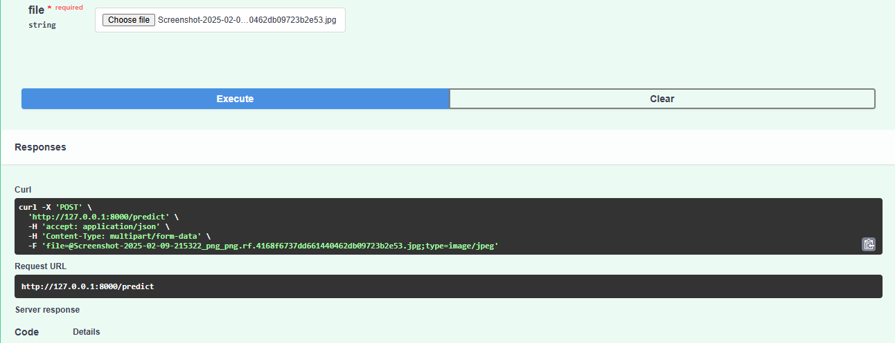
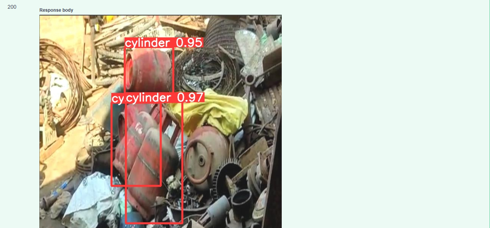

# Hazardous Waste Detection System using YOLOv9 and FastAPI

## Overview

An end-to-end Deep Learning and Computer Vision project developed to detect hazardous waste objects from images using YOLOv9. The project covers the complete AI workflow, including dataset annotation with Roboflow, model training, evaluation, and deployment through FastAPI for real-time predictions.

## Key Features

* Custom dataset annotation using Roboflow
* Hazardous waste object detection using YOLOv9
* Image preprocessing and model training pipeline
* Real-time prediction through FastAPI
* Performance evaluation using object detection metrics
* End-to-end deployment-ready computer vision solution

## Tech Stack

* Python
* YOLOv9
* PyTorch
* OpenCV
* Roboflow
* FastAPI
* Jupyter Notebook

## Project Workflow

1. Dataset annotation using Roboflow
2. Data preprocessing and augmentation
3. YOLOv9 model training and validation
4. Model evaluation and performance analysis
5. FastAPI integration for inference
6. Real-time hazardous waste detection

## Results

The trained model successfully detects hazardous waste objects from input images and demonstrates practical application of object detection techniques in environmental monitoring and waste management.

## Model Weights

The trained model weight files (`best.pt` and `last.pt`) are not included in this repository because they exceed GitHub's file size limitations. Model weights can be shared separately upon request.

## FastAPI Application





## Installation

```bash
git clone <repository-url>
cd hazwaste-detection-project
pip install -r requirements.txt
```

## Usage

1. Install dependencies.
2. Download the trained model weights.
3. Start the FastAPI application.
4. Upload an image for prediction.
5. View detected hazardous waste objects and confidence scores.

## Skills Demonstrated

- Deep Learning
- Computer Vision
- Object Detection
- YOLOv9
- FastAPI
- PyTorch
- Dataset Annotation
- Model Deployment

## Project Highlights

* Independently completed the full project lifecycle from data annotation to deployment.
* Built a production-oriented object detection pipeline using YOLOv9.
* Developed and deployed prediction APIs using FastAPI.
* Applied Deep Learning and Computer Vision techniques to solve a real-world problem.
* Gained hands-on experience in dataset preparation, model training, evaluation, and deployment.

## Future Enhancements

* Real-time video detection
* Cloud deployment
* Mobile application integration
* Expanded dataset with additional waste categories

## Author

**Kalishwaran B**

Data Analyst | Data Science Enthusiast | Computer Vision & AI Practitioner
